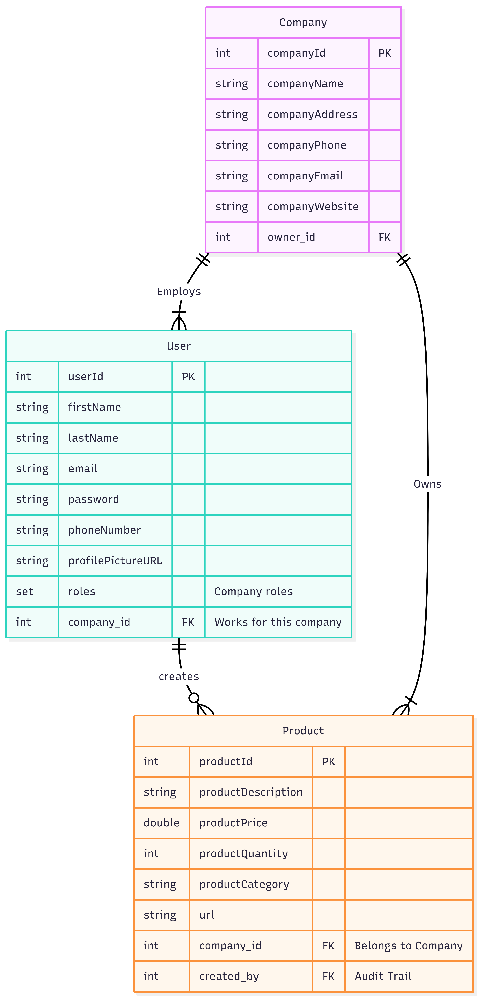

# InvenFlow - Enterprise Inventory Management System

InvenFlow is a robust, multi-tenant backend built with **Spring Boot** designed to manage inventory for small to medium-sized businesses. It features secure Role-Based Access Control (RBAC), company-wide data isolation, and comprehensive inventory tracking.

## Key Features

###  Security & Authentication
* **HttpOnly Cookies:** Secure session management that prevents XSS attacks.
* **RBAC (Role-Based Access Control):** distinct permissions for **ADMIN**, **MANAGER**, **EMPLOYEE**, and  **VIEWER".
* **Invitation System:** Admins can generate unique **Invite Keys** to onboard new employees securely.

###  Multi-Tenancy and privilege isolation
* **Company Isolation:** Users only see data belonging to their specific company.
* **Data Relationships:** Complex mapping between Users, Companies, and Products.
* **Audit Trails:** Every product tracks who created it and when.

###  Inventory Management
* **Stock Adjustments:** dedicated endpoints for restocking and auditing inventory counts.
* **Global Visibility:** Employees can view all company assets while maintaining data integrity.
* **Product Categories:** Organized management of assets (Electronics, Furniture, etc.).

---

##  Tech Stack

* **Language:** Java 21+
* **Framework:** Spring Boot 3
* **Database:** PostgreSQL (with JPA/Hibernate)
* **Documentation:** OpenAPI / Swagger UI
* **Build Tool:** Gradle

---

## Application Architecture

## 1.  Database Design
The database is designed for a multi-tenancy architecture. Every 'product' is connected to a company with a Foreign Key to ensure isolation of inventory ownership between companies. The schema also includes foreign keys for audit trails (tracking which employee is accountable for adding a specific product).



## 2. Secure Auth Flow
Security is handled through JWTs that are stored in **HTTP-only cookies**. The diagram below shows the relationship during Registration, Login, and Logout


## API Documentation

The API is fully documented using Swagger UI.
To open the Swagger UI, run the application and paste the URL in the browser:
http://localhost:8080/swagger-ui/index.html

### Core Endpoints

#### Authentication
#### Authentication
| Method | Endpoint | Description | Access |
| :--- | :--- | :--- | :--- |
| `POST` | `/api/auth/register` | Register a new user account and generates HttpOnly Cookie | Public |
| `POST` | `/api/auth/login` | Secure login (Generates HttpOnly Cookie) | Public |
| `POST` | `/api/auth/logout` | Invalidates the session cookie | Authenticated |
| `GET`  | `/api/auth/me` | Grabs the current logged in user data from the cookie| Authenticated|

#### Company Management
| Method | Endpoint | Description | Access |
| :--- | :--- | :--- | :--- |
| `POST` | `/api/company/create` | Create a new company (User becomes Owner) | User (No Company) |
| `POST` | `/api/company/join` | Join a company using an Invite Key | User (No Company) |
| `POST` | `/api/company/generate-key` | Generate a unique invite key for onboarding | **Admin Only** |
| `GET` | `/api/company/users` | View all employees in the company | Admin/Manager |
| `DELETE` | `/api/company/leave` | Leave the current company | User |
| `DELETE` | `/api/company/delete` | Delete the entire company and data | **Admin Only** |


#### Inventory & Products
| Method | Endpoint | Description | Access |
| :--- | :--- | :--- | :--- |
| `POST` | `/api/product/create` | Add a new product to inventory | Admin/Manager |
| `GET` | `/api/product/get` | Retrieve all company inventory | All Roles |
| `GET` | `/api/product/{id}` | Get details of a single product | All Roles |
| `PATCH` | `/api/product/stock/{id}` | Adjust stock levels (Restock/Audit) | Admin/Manager |
| `PATCH` | `/api/product/update/{id}` | Update product details (Price, Name) | Admin/Manager |
| `DELETE` | `/api/product/delete/{id}` | Remove a product from inventory | Admin/Manager |

---

## Getting Started 

* **Clone the Repo in your choice of Java-based IDE**
* **Update the "application. properties" file with your PostgreSQL database credentials**
* **Run the Spring project**
* **Go to the Swagger UI using the link and test the endpoints**
  ```bash
  http://localhost:8080/swagger-ui/index.html
  ```

